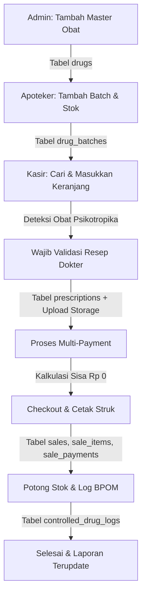

# Panduan Penggunaan Sistem & Output Detil - ApoGo POS

Dokumen ini berisi panduan teknis langkah-demi-langkah (step-by-step) pengisian data pada sistem **ApoGo POS** lengkap dengan contoh input nyata dan visualisasi output database, penyimpanan, serta cetakan struk belanja.

---



---

## 👑 Langkah 1: Setup Master Obat oleh Administrator (Admin)
Admin bertugas memasukkan katalog obat dasar ke dalam sistem sebelum stok fisik dicatat.

### 📋 Cara Pengisian Form (Halaman `/inventory`):
1. Masuk ke halaman **Gudang & Inventaris**.
2. Cari formulir **Tambah Master Obat** di sebelah kanan layar.
3. Masukkan contoh data berikut:
   * **Nama Obat:** `Alprazolam 0.5mg`
   * **Nama Kandungan Generik:** `Alprazolam`
   * **Kode KFA SatuSehat:** `93000450`
   * **Golongan:** Pilih `Psikotropika`
   * **Satuan:** Pilih `Tablet`
   * **Batas Stok Minimum:** `20`
4. Klik tombol **Simpan Obat**.

### 📦 Output yang Dihasilkan:
* **Database (Tabel `drugs`):** Satu baris data baru ditambahkan ke database Supabase Anda:
  ```json
  {
    "id": "e2f0d908-1234-4bc3-a567-89abcdef0123",
    "name": "Alprazolam 0.5mg",
    "generic_name": "Alprazolam",
    "kfa_code": "93000450",
    "category": "Psikotropika",
    "unit": "Tablet",
    "min_stock": 20,
    "created_at": "2026-06-14T09:30:00.000Z"
  }
  ```
* **Antarmuka UI:** Obat `Alprazolam 0.5mg` muncul di tabel katalog sebelah kiri dengan lencana (*badge*) biru bertuliskan **Psikotropika**.

---

## 🔬 Langkah 2: Registrasi Batch & FEFO oleh Apoteker
Apoteker bertugas memasukkan stok fisik obat berdasarkan no. batch pengiriman dan memantau tanggal kedaluwarsanya.

### 📋 Cara Pengisian Form (Halaman `/inventory/batches`):
1. Klik tombol **Kelola Batch** di halaman inventaris.
2. Cari formulir **Tambah Batch Baru** di sebelah kanan layar.
3. Masukkan contoh data berikut:
   * **Pilih Obat:** Pilih `Alprazolam 0.5mg` dari dropdown.
   * **Nomor Batch:** `B-ALP-003`
   * **Tanggal Kedaluwarsa:** `2026-10-31` (Kondisi hampir kedaluwarsa untuk pengujian)
   * **Harga Beli (Rp):** `12000`
   * **Harga Jual (Rp):** `18000`
   * **Stok Awal:** `100`
4. Klik tombol **Simpan Batch**.

### 📦 Output yang Dihasilkan:
* **Database (Tabel `drug_batches`):** Satu baris data baru ditambahkan ke database Supabase Anda:
  ```json
  {
    "id": "b9f91a0c-4567-4ab2-8de9-0f1e2d3c4b5a",
    "drug_id": "e2f0d908-1234-4bc3-a567-89abcdef0123",
    "batch_number": "B-ALP-003",
    "expiry_date": "2026-10-31",
    "purchase_price": 12000,
    "selling_price": 18000,
    "stock": 100,
    "created_at": "2026-06-14T09:35:00.000Z"
  }
  ```
* **Antarmuka UI:** Batch `B-ALP-003` tampil di daftar dengan lencana **Hampir Expired ⏳** (karena tanggal kedaluwarsa kurang dari 3 bulan dari hari ini).

---

## 💵 Langkah 3: Layanan Transaksi & Validasi Resep oleh Kasir
Kasir memproses pembelian obat di meja depan dan memvalidasi kelayakan resep obat golongan khusus.

### 📋 Cara Pengisian Form (Halaman `/pos`):
1. **Pencarian Produk:** Ketik `Alprazolam` di bilah pencarian kasir, lalu klik hasil pencarian **Alprazolam 0.5mg (Batch: B-ALP-003)**.
2. **Tambah Jumlah:** Naikkan quantity keranjang belanja menjadi `2` (Total Harga: Rp 36.000).
3. **Validasi Resep (Wajib untuk Psikotropika):**
   * Karena keranjang belanja berisi obat berkategori `Psikotropika`, tombol pembayaran terkunci otomatis.
   * Geser tombol **📋 Validasi Resep Dokter** menjadi aktif (ON).
   * Isi data resep dokter berikut:
     * **Nama Dokter:** `dr. H. Ade Wiramiharja`
     * **SIP Dokter:** `SIP/321/VIII/2026`
     * **Nama Pasien:** `Budi Santoso`
     * **No. HP Pasien:** `081234567890`
     * **Foto/Scan Dokumen Resep:** Unggah file contoh `resep-alprazolam.png`.
4. **Pengisian Metode Pembayaran Cepat (Single-Payment - Premium):**
   * Secara default, sistem menggunakan **Mode Single-Payment** yang super cepat dan responsif.
   * Cukup klik salah satu kartu pilihan metode pembayaran:
     * **Tunai (Cash):** Masukkan uang diterima (atau klik tombol pintas **Uang Pas** / pecahan **50.000** / **100.000**). Kembalian akan langsung terhitung secara otomatis.
     * **QRIS:** Sistem langsung memunculkan **Dynamic QR Code** yang di-generate dari nomor invoice unik. Kasir cukup meminta pelanggan memindai kode tersebut.
     * **Kartu:** Isi data opsional Nama Bank dan No. Ref kartu.
     * **Asuransi:** Isi data nama provider asuransi dan nomor polis.
   * *Catatan:* Jika ada kebutuhan memecah pembayaran (misal sebagian asuransi, sebagian tunai), kasir tinggal mengaktifkan saklar toggle **Bagi Pembayaran (Split Payment)** untuk membuka kalkulator multi-payment.
5. Klik **SELESAIKAN TRANSAKSI (PRINT STRUK)**.

### 📦 Output yang Dihasilkan:
* **Penyimpanan Berkas (Supabase Storage):** Berkas resep terunggah ke bucket `prescriptions` dengan nama unik: `INV-20260614-[Random].png`.
* **Database (Tabel `prescriptions`):**
  ```json
  {
    "id": "rx-777",
    "doctor_name": "dr. H. Ade Wiramiharja",
    "doctor_sip": "SIP/321/VIII/2026",
    "patient_name": "Budi Santoso",
    "patient_phone": "081234567890",
    "image_url": "https://[ref].supabase.co/storage/v1/object/public/prescriptions/INV-20260614-[Random].png",
    "verified_by": "id-kasir-aktif"
  }
  ```
* **Database (Tabel `sales`):**
  ```json
  {
    "id": "sale-111",
    "invoice_number": "INV-20260614-[Random]",
    "total_amount": 39960,
    "discount": 0,
    "tax": 3960,
    "prescription_id": "rx-777",
    "cashier_id": "id-kasir-aktif",
    "created_at": "2026-06-14T09:40:00.000Z"
  }
  ```
* **Database (Tabel `sale_items`):**
  ```json
  {
    "id": "item-222",
    "sale_id": "sale-111",
    "drug_id": "e2f0d908-1234-4bc3-a567-89abcdef0123",
    "batch_id": "b9f91a0c-4567-4ab2-8de9-0f1e2d3c4b5a",
    "quantity": 2,
    "price": 18000
  }
  ```
* **Database (Tabel `sale_payments` - Split Payment):**
  * Baris 1: `{ "sale_id": "sale-111", "payment_method": "insurance", "amount": 25000 }`
  * Baris 2: `{ "sale_id": "sale-111", "payment_method": "cash", "amount": 11000 }`
* **Pengurangan Stok Otomatis (Tabel `drug_batches`):**
  * Sisa stok batch `B-ALP-003` berkurang otomatis dari **100** menjadi **98**.
* **Log Pengeluaran Narkotika (Tabel `controlled_drug_logs`):**
  ```json
  {
    "id": "log-333",
    "drug_id": "e2f0d908-1234-4bc3-a567-89abcdef0123",
    "batch_id": "b9f91a0c-4567-4ab2-8de9-0f1e2d3c4b5a",
    "user_id": "id-kasir-aktif",
    "type": "out",
    "quantity": 2,
    "notes": "Penjualan resep via invoice INV-20260614-[Random]",
    "created_at": "2026-06-14T09:40:00.000Z"
  }
  ```
* **Output Struk Cetak Fisik (Thermal Receipt):**
  ```text
  =====================================
               ApoGo POS
            Apotek Modern
  =====================================
  Invoice : INV-20260614-4112
  Tanggal : 14 Juni 2026, 16:40
  Kasir   : Kasir Rina
  -------------------------------------
  Resep dr: dr. H. Ade Wiramiharja
  Pasien  : Budi Santoso
  -------------------------------------
  Alprazolam 0.5mg (B-ALP-003)
  2 Tablet x Rp 18.000      Rp 36.000
  -------------------------------------
  Subtotal                  Rp 36.000
  Diskon                    Rp 0
  PPN/Jasa                  Rp 0
  Total                     Rp 36.000
  -------------------------------------
  Metode Pembayaran:
  - ASURANSI                Rp 25.000
  - TUNAI                   Rp 11.000
  -------------------------------------
       Terima kasih atas kunjungan Anda
  =====================================
  ```

---

## 📊 Langkah 4: Pemantauan Buku Register & Finansial oleh Admin
Setelah transaksi kasir selesai, Admin dapat langsung melihat riwayat log mutasi dan pembukuan finansial apotek secara waktu nyata (real-time).

### 📋 Cara Pengisian Form:
*(Halaman ini bersifat read-only untuk pengawasan, tidak membutuhkan penginputan data)*

### 📦 Output yang Dihasilkan:
1. **Layar Register Psikotropika (`/controlled-logs`):**
   * Baris baru mutasi obat khusus langsung tampil secara otomatis menerangkan bahwa obat `Alprazolam 0.5mg` sebanyak `2 Tablet` telah dikeluarkan (`📤 Keluar`) oleh operator dengan referensi transaksi resep dokter `INV-20260614-[Random]`.
2. **Layar Laporan Penjualan (`/reports`):**
   * **Total Omset** bertambah `Rp 36.000`.
   * **Jumlah Transaksi** bertambah `1 Invoice`.
   * Log transaksi mencatat detail split payment yang tervalidasi (Asuransi: Rp 25.000 & Tunai: Rp 11.000) untuk keperluan pembukuan harian.
