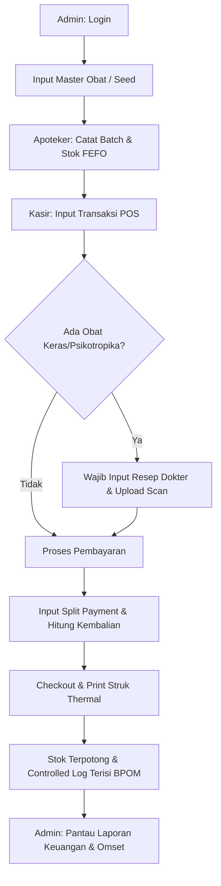

# Panduan Alur Kerja Sistem (Workflow Guide) - ApoGo POS

Dokumen ini menjelaskan alur operasional lengkap penggunaan sistem **ApoGo POS** dari masing-masing peran pengguna (Admin, Apoteker, Kasir) beserta output konkret yang dihasilkan pada setiap tahap.

---

---

## 👑 1. Alur Kerja Administrator (Admin)
Admin memegang kendali penuh terhadap kontrol master data dan pemantauan performa bisnis apotek.

### Langkah-langkah Operasional:
1. **Autentikasi & Login:** Masuk ke sistem di halaman `/login` menggunakan akun administrator.
2. **Setup Awal Katalog Obat (`/inventory`):**
   * Mengisi master data obat (Nama obat, Kandungan Generik, Kode KFA SatuSehat, Golongan Obat, Satuan, dan Batas Minimum Stok).
   * Atau mengklik tombol **🌱 Seed Database** untuk langsung menyuntikkan data obat awal sebagai demonstrasi instan.
3. **Analisis Finansial (`/reports`):**
   * Membuka menu Laporan & Analitik untuk melihat total omset bersih, subsidi diskon, pajak PPN/jasa racik terkumpul, dan histori transaksi lengkap beserta rincian metode pembayaran yang digunakan.

### 📦 Output yang Dihasilkan:
* **Master Katalog Obat:** Entri data di tabel `drugs` yang menjadi acuan bagi Apoteker dan Kasir.
* **Laporan Finansial:** Laporan laba-rugi serta rincian histori pembayaran multi-payment (*split payment*) per invoice.

---

## 🔬 2. Alur Kerja Apoteker (Pharmacist)
Apoteker bertanggung jawab menjaga kualitas obat, mencatat batch baru dengan aturan kedaluwarsa terdekat (FEFO), dan memantau peredaran obat psikotropika/narkotika.

### Langkah-langkah Operasional:
1. **Penerimaan Barang & Registrasi Batch (`/inventory/batches`):**
   * Membuka halaman batch inventaris untuk mendaftarkan stok masuk baru.
   * Menginput Nomor Batch unik (contoh: `B-ALP-03`), Tanggal Kedaluwarsa (*expiry date*), Harga Beli, Harga Jual, Jumlah Stok, dan memilih relasi Master Obat yang sesuai.
2. **Pemantauan Stok & FEFO Alert:**
   * Memantau daftar batch obat yang diurutkan otomatis dari tanggal kedaluwarsa paling dekat.
   * Sistem otomatis memunculkan tanda **Hampir Expired ⏳** (jika kedaluwarsa < 3 bulan) dan **Stok Menipis ⚠️** (jika jumlah stok <= 10).
3. **Audit Buku Log Khusus (`/controlled-logs`):**
   * Memantau Buku Register Narkotika & Psikotropika untuk memastikan kepatuhan pelaporan kepada BPOM dan Dinas Kesehatan RI.

### 📦 Output yang Dihasilkan:
* **Entri Batch Aktif:** Stok obat baru terekam di tabel `drug_batches` dengan harga jual masing-masing.
* **Buku Register Khusus:** Log mutasi masuk dan keluar obat psikotropika di tabel `controlled_drug_logs`.

---

## 💵 3. Alur Kerja Kasir (Cashier)
Kasir fokus pada pelayanan transaksi pelanggan di meja depan secara cepat dan akurat.

### Langkah-langkah Operasional:
1. **Pencarian Obat & Input Keranjang (`/pos`):**
   * Mencari produk berdasarkan Nama Obat atau Nomor Batch di kotak pencarian kasir.
   * Sistem hanya menampilkan obat dengan stok aktif dan memprioritaskan batch terdekat kedaluwarsa (**FEFO**).
2. **Validasi Resep Dokter (Jika Diperlukan):**
   * Jika kasir memasukkan obat golongan Keras, Psikotropika, atau Narkotika ke keranjang belanja, tombol checkout akan terkunci dan sistem mewajibkan pengaktifan **Validasi Resep Dokter**.
   * Kasir menginput Nama Dokter, SIP, Nama Pasien, Nomor HP, serta mengunggah foto resep asli.
3. **Kalkulasi & Split Payment:**
   * Kasir dapat memasukkan pembayaran dengan beberapa metode sekaligus (misal: Rp 100.000 dengan Asuransi BPJS, sisanya Rp 25.000 dengan QRIS).
   * Tombol "Selesaikan Transaksi" akan aktif jika sisa pembayaran (kekurangan) bernilai tepat **Rp 0**.
4. **Cetak Struk & Finalisasi:**
   * Kasir mengklik tombol **Selesaikan Transaksi**. Browser otomatis membuka dialog cetak (*Print Dialog*) dengan format struk thermal 80mm yang bersih (UI latar belakang kasir otomatis tersembunyi).

### 📦 Output yang Dihasilkan:
* **Struk Thermal Fisik:** Kertas tagihan berisi rincian obat, dokter penulis resep, dan pembagian split payment.
* **Pengurangan Stok:** Stok obat pada tabel `drug_batches` otomatis berkurang sejumlah yang dibeli.
* **Log Narkotika Otomatis:** Jika ada alprazolam/psikotropika terjual, log pengeluarannya langsung tertulis otomatis ke tabel `controlled_drug_logs` beserta nomor faktur/invoice.
* **Rekaman Transaksi:** Data penjualan tersimpan di tabel `sales`, `sale_items`, dan `sale_payments`.
